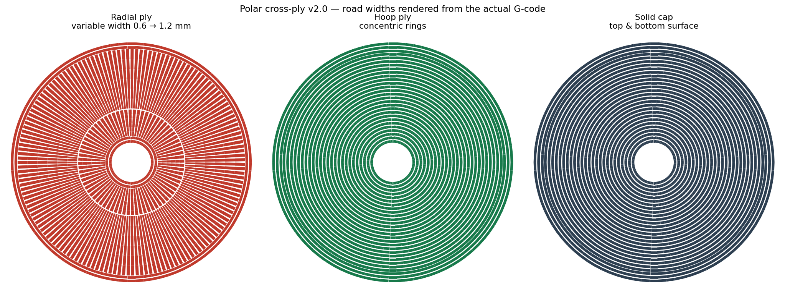

# Polar Cross-Ply Infill

A **polar cross-ply** infill fills an axisymmetric region with roads aligned to a
polar coordinate system about a detected axis, alternating orientation between
layers:

- **Hoop plies** — concentric rings about the axis (roads run circumferentially).
- **Radial plies** — spokes from the bore outward with **variable road width**:
  width grows in proportion to radius (nozzle diameter up to nozzle max), which
  holds coverage *exactly* constant rather than letting it diverge as `1/r`.
  Width is produced by holding volumetric rate constant and slowing the head.
  No tie rings, no anchors, no circumferential step-overs — so roads never cross.

Alternating the two is cross-ply plywood in cylindrical coordinates: continuous,
load-path-aligned roads through the full thickness in **both** principal in-plane
directions of a disc/ring/annulus.

Two refinements are on by default: **seamless spiral hoop plies** (each hoop layer is
one continuous spiral — no per-ring seam that could stack into a hoop crack line) and
**helically-staggered radial plies** (each radial layer is rotated so the gaps between
spokes advance around the part instead of columning up in Z). Together with the
alternation, that makes this the FDM analogue of **hoop-plus-helical filament
winding** — how composite pressure vessels and flywheels are actually made. The hoop
plies are just stock **concentric** infill (perimeter-offset), so on a square outline
they're nested squares, on an oval they're ovals — it follows whatever shape the part
is.



## Honest positioning (read this first)

This is a **special-purpose** pattern, not a general infill, and it is **not a new
principle**:

- **Concentric infill is already stock** in every major slicer — the hoop plies are
  not new. Only the radial plies + auto-centered alternation are.
- Aligning roads to principal-stress trajectories and alternating to balance
  anisotropy is well established (principal-stress-line / function-aware toolpaths;
  the cross-ply idea). For an axisymmetric disc under axisymmetric load the principal
  stress directions **are** radial and hoop — so this is the closed-form, FEA-free
  *special case* of principal-stress-line infill.
- The contribution is **practical**: a parameterized, dependency-free way to do the
  right thing automatically for a common geometry class (discs, rings, flywheels,
  pulleys, hubs, bearing carriers, pressure annuli) that grid/gyroid ignore and that
  stock concentric only half-serves.

**Use it for** parts loaded by spin, press-fit at the bore, or radial/hoop pressure.
**Don't use it for** non-axisymmetric parts, or parts whose dominant load is torque
hub→rim (this pattern is weakest in torsion — no ±45° reinforcement).

## What's in here

| File | For whom | What it is |
|---|---|---|
| `polar_crossply.py` | slicer devs | Dependency-free reference generator (the pattern math). Ports directly to a slicer `Fill` class. |
| `polar_slicer.py` | people who want to print | Standalone parametric G-code generator for axisymmetric parts. Prints today, no recompiled slicer needed. |
| `demo.py` | anyone | Renders `preview.png` and prints band/coverage stats. |
| `example_config.json` | printers | Example part definition for `polar_slicer.py --config`. |
| `SPEC.md` | slicer devs / PR authors | Full parameter spec, algorithm, mechanics, limitations, and integration plan for the Slic3r family + CuraEngine. |
| `HOWTO_PRINT.md` | printers | Two routes to print today: the generator, and a G-code post-processor for complex outlines. |

## Quickstart — print a part today

No third-party packages needed to generate G-code (Python 3.9+).

```bash
python polar_slicer.py --od 66.2 --id 10.5 --height 9.4 \
    --line_width 1.0 --nozzle_diameter 0.6 \
    --nozzle_temp 210 --bed_temp 60 \
    -o my_rotor.gcode
```

**Before printing:** set temperatures for your material, and paste your printer's
start/end G-code (`--start_gcode_file` / `--end_gcode_file`) — the built-in defaults
are generic Marlin and may not suit your machine. Then preview the `.gcode` and scrub
the layers before committing filament. See `HOWTO_PRINT.md`.

## Adding it natively to a slicer

See `SPEC.md` §7. In the Slic3r family (PrusaSlicer / OrcaSlicer / Bambu / SuperSlicer)
it's a new `InfillPattern` enum value + a `Fill`-derived class implementing
`_fill_surface_single`, clipping the generated polylines to the region ExPolygon. The
band/spoke math ports verbatim from `polar_crossply.py`.

## Version

Current: **v3.1** — extrusion model validated against measured parts (deposition 1.005). See [`CHANGELOG.md`](CHANGELOG.md).
Reference profile `profiles/rotor_coreone_v2.json`, reference output
`examples/rotor_COREONE_E_varwidth_full.gcode` (test printed).

## Analysis

An in-progress comparative study lives in [`analysis/`](analysis/). Two results from it
are solid and independently reproduced; the rest is **not yet publishable** (placeholder
material properties, no coupon data, one corrected error — see the folder's correction
log).

- **Press-fit governs, spin does not.** A 0.05 mm radial interference puts ~25.6 MPa
  hoop stress at the bore — ~46 % of the PLA road-direction allowable from assembly
  alone. Centrifugal stress doesn't reach that allowable until ≈66 500 rpm (231 m/s rim
  speed). Spin is this pattern's best marketing story and its least relevant one.
- **Torsion is an allowables problem, not a stress problem.** The in-plane torque field
  τ = T/(2πr²h) is statically determinate — identical for *every* layup. No in-plane
  road arrangement without ±45° content can reduce the shear it must carry. The
  weakness is structural, not a tuning issue.

The study also exposed a real defect in the generator: a radial ply deposits ~124 % of
a solid layer's material while covering only ~83 % of the area. See
[`analysis/README.md`](analysis/README.md).

## Status

Reference implementation and standalone generator are working and tested. Native
slicer integration is specified but not yet submitted upstream. Contributions and
print-test data welcome — especially hoop/radial/torsion coupon results vs stock
concentric.

## License

MIT — see `LICENSE`.
